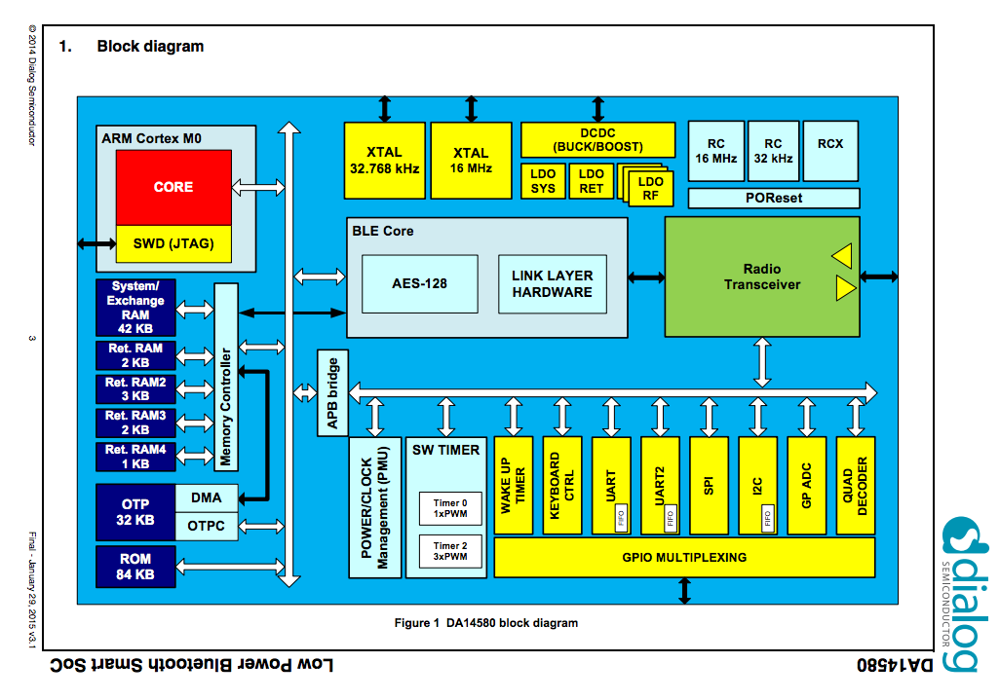

# BLEチップ

## BLEチップ種類

| Chip名 | Maker | 送信感度|受信感度|送信電流 | 受信電流|スリープ時電流|
| -- | -- |
| [NRF51822](http://www.nordicsemi.com/eng/Products/Bluetooth-R-low-energy/nRF51822) | Nordic Semiconductor |  |
| NRF51422 | Nordic Semiconductor | [Web](http://www.nordicsemi.com/eng/Products/ANT/nRF51422) |
| CSR1010 | CSR | [Datasheet](https://www.csrsupport.com/download/39359/CSR1010%20Data%20Sheet%20CS-231985-DS.pdf) |
| CSR1011 | CSR | [Datasheet](https://www.csrsupport.com/download/40289/CSR1010%20Data%20Sheet%20CS-231986-DS.pdf) |
| CSR1012 | CSR | [Datasheet](https://www.csrsupport.com/download/47278/CSR1012%20Data%20Sheet%20CS-238833-DS.pdf) |
| CC2540 | TI | [Web](http://m.tij.co.jp/product/jp/CC2540) |
| CC2541 | TI | [Web](http://m.tij.co.jp/product/jp/CC2541) |
| BCM20737S | Broadcom | [Datasheet](http://www.broadcom.com/collateral/pb/WICED-Sense-PB100.pdf) |
|BlueNGR | STMicro | [Web](http://www.st.com/web/catalog/sense_power/FM1968/CL1976/SC1898/PF258646?ecmp=pf258646_link_emf_jan2014&sc=bluenrg) |
| CYBL10X6X | CYPRESS | [Web](http://japan.cypress.com/?rID=99422 ) |
| DA14580 | [dialog](http://www.dialog-semiconductor.com/) | [Datasheet](http://www.dialog-semiconductor.com/docs/site-pdf/da14580_ds_v3-1.pdf?sfvrsn=2) |

#DA14580のBlock diagram

