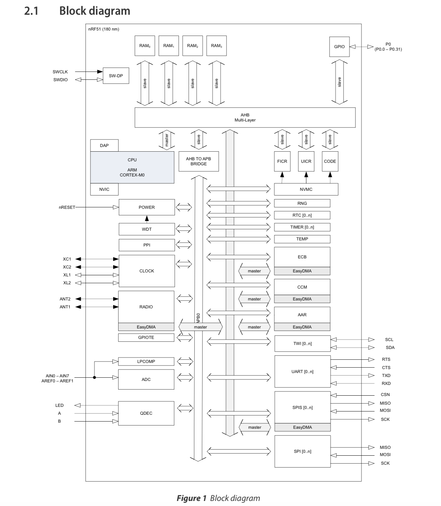
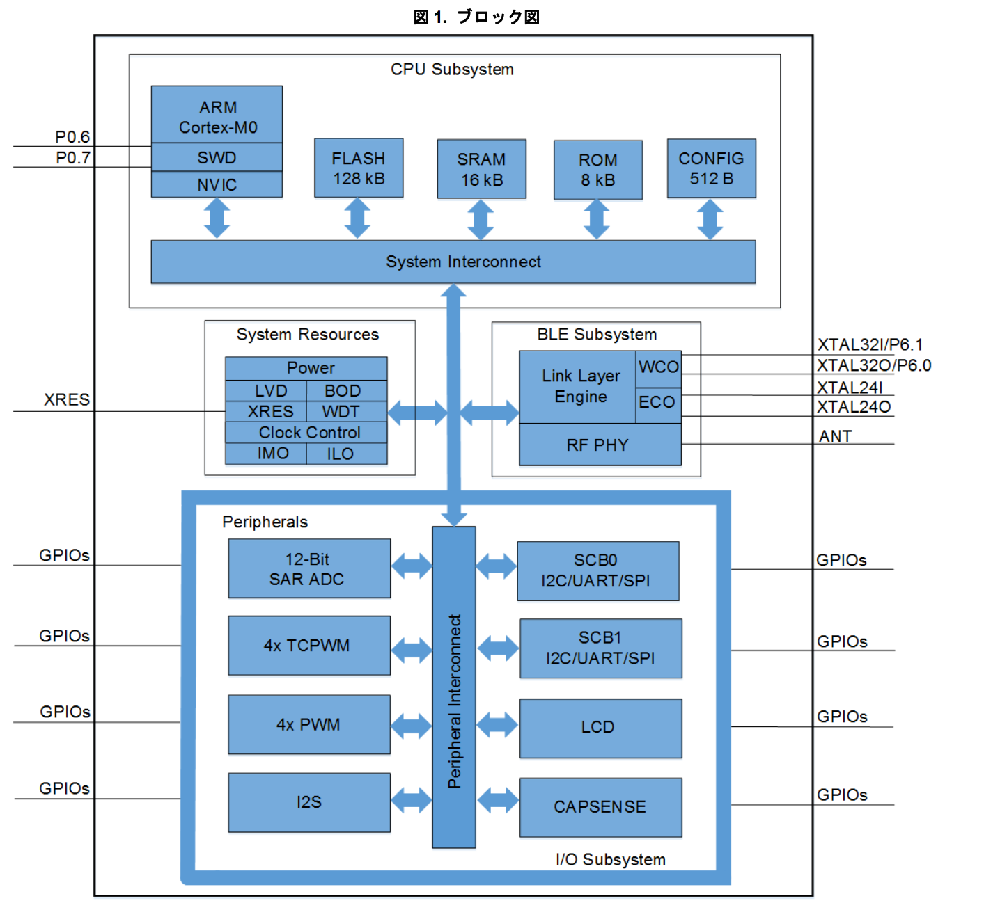

# BLEチップ

## BLEチップ種類

| Chip名 | Maker |Co-Proccesor| 送信感度|受信感度 |送信時最大電流 (0dBm時) | 受信時最大電流|スリープ時最小電流|
| -- | -- |
| [DA14580](http://www.dialog-semiconductor.com/products/bluetooth-smart) | [dialog](http://www.dialog-semiconductor.com/) | ARM® Cortex™ M0 |0dBm |-93dBm |3.4mA(DD変換時) |3.7mA(DD変換時)| 0.48uA|
| [NRF51822](http://www.nordicsemi.com/eng/Products/Bluetooth-R-low-energy/nRF51822) | Nordic Semiconductor |  ARM® Cortex™ M0 | |-93 dBm| 10.5mA 8mA (DD変換)| 13 mA 9.7mA(DD変換)| |
| NRF51422 | Nordic Semiconductor | [Web](http://www.nordicsemi.com/eng/Products/ANT/nRF51422) |
| [CSR1010](https://www.csrsupport.com/download/39359/CSR1010%20Data%20Sheet%20CS-231985-DS.pdf) | CSR | 独自MCU(RISC) | +9dBm | -93dBm| |||
| [CSR1011](https://www.csrsupport.com/download/40289/CSR1010%20Data%20Sheet%20CS-231986-DS.pdf) | CSR  | 独自MCU(RISC) | +9dBm | -93dBm| |||
| [CSR1012](https://www.csrsupport.com/download/47278/CSR1012%20Data%20Sheet%20CS-238833-DS.pdf) | CSR  | 独自MCU(RISC) | +9dBm | -93dBm| |||
| CC2540 | TI | [Web](http://m.tij.co.jp/product/jp/CC2540) |
| CC2541 | TI | [Web](http://m.tij.co.jp/product/jp/CC2541) |
| BCM20737S | Broadcom | [Datasheet](http://www.broadcom.com/collateral/pb/WICED-Sense-PB100.pdf) |
|BlueNGR | STMicro | [Web](http://www.st.com/web/catalog/sense_power/FM1968/CL1976/SC1898/PF258646?ecmp=pf258646_link_emf_jan2014&sc=bluenrg) |
| [CYBL10X6X](http://japan.cypress.com/?rID=99422 ) | CYPRESS |ARM® Cortex™ M0| +3dBm |-89dBm|15.6mA| 16.4ma|1.3μA|

#DA14580のBlock diagram

#NRF51822のBlock diagram

#CYBL10X6XのBlock diagram

