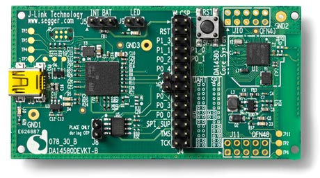

# Dialog系BLEモジュール

## Co-processor
ARM® Cortex™ M0

## 開発者サイト
http://support.dialog-semiconductor.com/

## 開発に必要なハードウェア
### DA14580DEVKT-B
Dialog’s DA14580 Bluetooth® Smart Development Kit - Basic

http://dialog-semiconductor.com/products/bluetooth-smart/smartbond-development-tools/bluetooth-smart-development-kit

| 開発キット | 購入先 | 価格|
| -- | -- | -- |
| [DA14580DEVKT-B](http://www.futureelectronics.com/en/technologies/development-tools/rf-wireless/Pages/2046391-DA14580DEVKT-B.aspx?IM=0) | Future Electronics | $99 |
| [DA14580DEVKT-B](http://www.digikey.jp/product-detail/ja/DA14580DEVKT-B/1564-1000-ND/5113983) | Digi-key|13,320円|

## 開発に必要なソフトウェア

| ツール | 提供元 |
| -- | -- |
| [Keil MDK-ARM Version 5](https://www.keil.com/download/product/) | Keil |
| [the Jlink software & documentation pack for Windows](https://www.segger.com/jlink-software.html)|segger|

## 開発に必要なドキュメント

[User Manual
DA14580 Bluetooth® Smart Development Kit – Basic
UM-B-025](http://www.cdiweb.com/datasheets/iwatt/DA14580DEVKT-BUserGuide.pdf)
